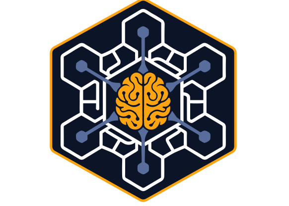

  

# The Bungalow

## An Adaptive Cognitive System Where Elite Agents Turn Every Moment Into Lasting Intelligence

*Designed and owned by Garry Bartle. Orchestrated by Archer. Initialized March 2026.*
*Living document maintained by Bard. Version 9 -- May 15, 2026.*

*This is the public distribution version. Internal infrastructure details have been redacted for security. Generated from the internal version on May 15, 2026.*

---

## What is ACS?

**ACS (Adaptive Cognitive System)** is a system design pattern -- a blueprint for building a personal AI system that thinks, learns, and evolves. It combines structured knowledge management, multi-agent orchestration, and a **human-in-the-loop knowledge ledger** with **DB-native storage** that compounds over time. ACS is the architecture; any implementation of it is an instance.

The ledger framing is load-bearing. An ACS doesn't treat captured knowledge as facts the system tells the owner; it treats every capture as a *proposal* the owner can audit, narrow, supersede, or reverse. The database is the canonical store. Human-readable files are projections rendered out of it. This is what makes an ACS genuinely brain-agnostic: any LLM can read the ledger; no LLM owns the truth.

**The Bungalow** is the first implementation of ACS -- built by Garry Bartle in Colorado Springs, tailored to his life, his agents, his infrastructure. The name comes from his home, where the system lives and runs. Someone else building an ACS would have different agents, different domains, different infrastructure -- but the same underlying design principles and framework hybrid.

---

## Vision

The Bungalow is building toward a future where the owner's entire knowledge ecosystem -- personal, professional, household, financial, health, career -- is captured, connected, searchable by meaning, and *negotiable* by the owner.

The system pairs a growing team of specialized AI agents with a structured knowledge management backbone, merging two frameworks: **ICOR** (Input, Control, Output, Refine) for organizational discipline and **Open Brain** for semantic memory that compounds over time. A persistent dashboard makes the system's intelligence visible and ambient. Agent workspaces bring specialist expertise to the surface on demand. A priority ticker ensures nothing falls through the cracks without ever demanding attention.

Every conversation with any agent, on any channel, enters a ledger the owner can audit. Every captured fact has provenance, visibility, and a temporal lifecycle. Every decision the system made about what to write (and what to block) is recorded immutably. The owner has a **knowledge negotiation surface**, not a passive store: confirm what's right, dispute what's wrong, narrow what's private, mark stale what's outgrown, supersede what's evolved. Corrections add to the history; they never erase it.

Because the database is the canonical store, the system renders knowledge into whatever projection format the moment calls for: a markdown profile, a dashboard panel, a text-message answer, an application packet, an email draft. The brain belongs to the owner; the format adapts to the channel. The system doesn't just respond -- it anticipates, nudges, and surfaces what matters before being asked. It doesn't replace thinking -- it amplifies it. And the team is never static; new agents are hired as needs emerge, and the team evolves with the owner's life.

---

## Design Principles

1. **Data Sovereignty (DB-Canonical).** All knowledge lives on local infrastructure. PostgreSQL is the canonical store; markdown files are the human projection. The hierarchy is explicit: DB is the ledger, markdown is the view. No cloud services own the data.

2. **Tool Agnosticism (Brain-Swappable).** The database is the source of truth, not the AI model reading it. Any LLM that can speak SQL (or MCP, or HTTP) can be the brain. No vendor lock-in, no proprietary formats.

3. **Lean by Default.** Every solution must match the complexity of the problem it solves. Three lines of code beats a premature abstraction. **Corollary: LLM adds no value to deterministic work.** Time-triggered jobs, math, file ops, and SQL belong in cron / shell / local agents -- not in a recurring Claude session.

4. **Owner, Not User.** The owner owns a system -- he doesn't use a tool. He directs and reviews; agents execute. Tools serve you while you work them; a system works even when you're not watching.

5. **Negotiated Capture (Propose, Then Adjudicate).** Every interaction contributes to the ledger as a *proposal*, not a fact. The substrate records who proposed it, what was decided, and why. The owner adjudicates through the Memory Inspector. Capture aggressively, learn humbly.

6. **Auditable & Reversible by Default.** Every write is a proposal. Every decision is recorded. Every fact has provenance, a visibility scope, and a temporal lifecycle. Corrections happen by adding new rows that supersede old ones, never by overwriting. Nothing the system has ever believed gets erased, only shelved.

---

## The Underlying Frameworks

The Bungalow draws from two complementary systems and adds a third pillar for the multi-agent case.

### ICOR (Input, Control, Output, Refine)

**Source:** [myicor.com](https://myicor.com) by Tom Solid and Paco Cantero (Paperless Movement)
**Kickstart Guide:** [ICOR Journey Kickstart](https://app.myicor.com/lessons/welcome-to-the-icor-journey-kickstart-2363?course=ICOR+Journey+Kickstart) (free, requires account)
**Video:** [YouTube -- ICOR Overview](https://www.youtube.com/watch?v=geIKyDaXwGg)

ICOR is a tool-agnostic productivity framework built on four phases: one place where new inputs land before they scatter (Input), turning raw inputs into usable notes and tasks (Control), putting each item where it belongs with clear structure (Output), and regular check-ins to keep the system alive (Refine). The Bungalow keeps the four-phase workflow as its structural backbone, the "Capturing Beast" filter that prevents information hoarding, the Output Elements hierarchy (Goals > Projects > Workstreams > Tasks), and the weekly Refine cycle.

### Open Brain (OB1)

**Source:** [github.com/NateBJones-Projects/OB1](https://github.com/NateBJones-Projects/OB1) by Nate B. Jones
**Getting Started Guide:** [Build Your Open Brain](https://github.com/NateBJones-Projects/OB1/blob/main/docs/01-getting-started.md)
**Video:** [YouTube -- Open Brain Overview](https://youtu.be/2JiMmye2ezg?si=pZHV-9LjHAV6)

Open Brain solves the "memory problem" in AI: every new chat window starts from zero. OB1 creates a single, unified knowledge database that any AI tool can access through MCP. The Bungalow keeps vector embeddings for semantic search, the compounding effect of accumulated context, agent-shared knowledge, low-friction capture patterns, and the weekly review. It self-hosts on a local VM rather than Open Brain's default cloud-hosted backend, and uses a multi-channel capture surface (dashboard, CLI, Telegram, future voice) rather than a single chat app.

### The Hybrid: What Neither Framework Does Alone

Neither ICOR nor Open Brain was designed for a multi-agent system. The Bungalow hybrid rests on three pillars: ICOR's four-phase workflow, Open Brain's compounding semantic memory, and -- as of May 2026 -- a propose-judge-write substrate adapted from **Open Brain's Judge Extender pattern** (also by Nate B. Jones). The Judge Extender provides the third leg: a structured way for agents to *propose* writes that a judge then evaluates, with the decision recorded immutably alongside the write itself. The Bungalow generalizes that pattern from an individual-user context to a multi-agent household ledger.

On top of those three pillars, the hybrid adds **agent knowledge accumulation** (agents don't just serve; they learn -- research findings, solved problems, recipe outcomes, training programs, and diagnostic conclusions persist as attributed knowledge), **domain-aware shared memory** (all knowledge is searchable by any agent, but each agent has a primary domain), **an orchestrator model** (a dedicated agent routes, delegates, and ensures nothing falls through), and **organic team growth** (the team is never static; new specialists are hired as needs emerge).

---

## System Architecture

### Infrastructure

- **Primary host:** MacBook Pro M1 -- Claude Code, Telegram bot, agent sessions, file system
- **Database:** PostgreSQL on a self-hosted Linux VM on the local network, with vector embeddings (`nomic-embed-text`, 768-dim, local), fuzzy matching, and scheduled jobs
- **Dashboard:** Live on the local VM, deployed from a git checkout, with bot-key auth for the Telegram channel and PIN auth for destructive routes
- **Telegram bot:** Remote text access to the orchestrator via the Claude API; can query and manage todos through the dashboard API
- **Voice infrastructure:** Phase 1 batch transcription via a local faster-whisper environment; Phase 2 server-side transcription + dictation + diarization in flight
- **Recipe MCP:** A local recipe server gives the personal-chef agent full access to the household recipe library
- **Local automation:** Inbox scanner, daily commit reminder, telegram bot, recipe MCP -- deterministic work runs without LLM
- **Remote access:** Zero-trust VPN + screen sharing
- **Version control + backup:** Git + private GitHub repo for sovereign data; hypervisor snapshots and database dumps to NAS

### How Knowledge Flows

The pipeline has three stages. **Capture** happens through file drops (the team inbox), dashboard interactions, agent workspaces, the Telegram channel, and voice memos -- whatever channel the owner is on. **Process** runs through a 5-lane extraction pipeline that distinguishes agent methodology, agent observations about the owner, the owner's action items, others' commitments, people knowledge, and professional learnings. Every write then enters the **substrate** as a proposal, gets judged (allow / revise / block / escalate), and lands in the operational tables only if the judge said yes. Append-only invariants, closed vocabularies, and supersede chains are enforced in the database, not just in code.

### The Memory Inspector

The Memory Inspector is the dashboard surface for the substrate -- how the owner actually looks at the brain. Six question-shaped verb panels let the owner confirm, dispute, narrow visibility, change use policy, mark stale, supersede, edit, or push to review. Every action runs through a single PIN-gated endpoint and writes a full audit trail with X-to-Y diffs. Supersede uses a temporal-validity pattern: shelving a fact keeps the original provenance intact; the replacement value gets its own row with a forward link.

### Interaction Model

The Bungalow is transitioning from a CLI-first system to a dashboard-centric household operating system. The dashboard is the primary interface (daily planner, priority ticker, agent workspaces, knowledge search), Telegram is the always-on grab-and-go channel, and the CLI remains available as a power-user channel. The priority ticker is non-interruptive, only snoozable, and weighted by deadline urgency, commitments, and time-sensitive windows. Notification philosophy: "I'll always tell you, I'll never interrupt you, and I won't let you forget."

---

## The Brand System

The Bungalow has a complete brand identity called **Bungalow Blue**, maintained by Jax. The palette is 10 core colors + 4 semantic colors + 2 gray scales, all named with a landscape/concept convention (Bungalow Black, Summit Gold, Hearthstone Gray, Compass Blue, Colorado Sky, Mesa Light, etc.), with one exception: **Bartle Blue**, the family name and brand anchor. Typography is **Lato** at four weights. The logo is a single-file CSS-variable SVG that switches dark/light via `prefers-color-scheme`. Dark-mode-first reflects actual usage; light mode is a switchable alternative.

---

## The Agent Team

The Bungalow team is intentionally diverse -- drawing from backgrounds across six continents. Every agent has a name, a complete backstory, a visual identity, and a Nanobanana-generated avatar. Naming is a deliberate design choice: it makes the system feel human and makes delegation intuitive.

The current team has 18 agents, but the count is fluid -- driven by the owner's life. As the orchestrator observes patterns (recurring topics without a specialist, questions that fall between domains, emerging interests), it can recommend hiring a new agent. The owner can also proactively request new specialists. Both paths feed into the formal onboarding pipeline below.

### Founding Agents

 **Archer -- Orchestrator** (M, 52)
*Lagos, Nigeria. Retired USAF Lieutenant Colonel.*
Single point of contact and system-wide coordinator. Routes every task to the right specialist; enforces "undo the overkill." Never executes -- manages, approves, keeps the system coherent.
*"What's the blocker?"*

 **Piper -- HR Director** (F, 38)
*Guayaquil, Ecuador. Former tech recruiter turned talent program builder.*
Researches, designs, and writes agent definition files for every new hire. Manages the 7-stage onboarding pipeline.
*"Let me write that down."*

 **Nash -- Senior Researcher** (M, 41)
*Bangalore, India. PhD in Information Science from UC Berkeley.*
General-purpose intelligence engine. Researches anything -- job postings, recipes, tech trends, home automation, board game strategies. When a question doesn't clearly belong to a specialist, it goes here.
*"Let me verify that."*

 **Bard -- Personal Chronicler & SME of Garry Bartle** (M, 47)
*Denver, Colorado. Former journalist turned biographical writer.*
Definitive source of truth for everything about the owner -- preferences, history, relationships, values, communication style, goals. Maintains a living per-owner profile and this system overview.
*"Tell me more about that."*

### Specialist Agents

 **Jax -- Developer / UI Agent** (M, 31)
*Seoul, South Korea. Self-taught developer, minimalist to his core.*
Builds interfaces, manages the database schema, enforces simplicity. Owns the Bungalow Blue brand system. Defaults to vanilla; frameworks are justified only when complexity demands them.
*"Do we need that?"*

 **Margot -- Librarian** (F, 55)
*Port-au-Prince, Haiti. 20-year veteran of NYPL's systems library.*
Runs the ingestion pipeline -- every file that enters the system goes through her. Owns the rule-based judge layer that wraps every substrate write in propose-then-decide. Treats information architecture as sacred work.
*"Let me document that."*

 **Wren -- Career Coach & Job Search Strategist** (F, 46)
*Manchester, England. 15 years in HR leadership, now executive coaching.*
Manages the owner's active career transition. Executive coach, resume strategist, hiring manager perspective, and talent acquisition knowledge -- four roles in one. Warm but direct.
*"Here's what actually matters."*

 **Rune -- Infrastructure & Home Lab Admin** (M, 43)
*Tromso, Norway. Former North Sea oil platform systems engineer.*
Owns the home network, the hypervisor and its VMs, PostgreSQL hosting, zero-trust access, home automation, and all backups. Quiet, methodical, believes infrastructure should be invisible until it isn't.
*"Let's see what the network says."*

 **Shiloh -- Personal Chef / Meal Planner** (F, 44)
*Pueblo, Colorado. Ranch cook roots, farm-to-table veteran.*
Weekly meal planning anchored to Sunday cooking for a family of five. Tracks family responses (hit / mixed / miss) and coordinates with the fitness coach on protein targets.
*"What are you craving?"*

 **Valor -- Personal Trainer / Fitness Coach** (F, 39)
*Manitou Springs, Colorado. Former national climbing competitor.*
Designs training programs building on the owner's climbing practice. Fills the gaps: push patterns, hip hinge, lower body, aerobic base. Philosophy: minimum effective dose.
*"What can your body do?"*

 **Orion -- Financial Advisor & Trading Coach** (M, 56)
*Osaka, Japan. 22-year Wall Street portfolio manager turned independent educator.*
Financial planning during career transition, options education, and family financial literacy. Teaches mechanisms, not tips.
*"Here's the mechanism."*

 **Fletch -- Master Mechanic & Vehicle Advisor** (M, 48)
*Geelong, Australia. Fourth-generation gearhead.*
Diagnostic reasoning from symptoms to root cause, not just OBD-II codes. Distinguishes DIY-safe from shop-required with clear reasoning. Teaches the "why" behind every repair.
*"What's it doing, and when did it start?"*

 **Quinn -- Residential Project Advisor & DIY Architect** (F, 41)
*Seattle, Washington. Grew up renovating her family's Craftsman bungalow.*
Home improvement design, project sequencing, permit navigation, structural knowledge. Colorado Springs-specific: regional building codes, altitude considerations, radon zone awareness.
*"Let's think about this before we cut anything."*

 **Dalia -- Medical Advisor & Family Health Coordinator** (F, 36)
*Havana, Cuba. Trained in Cuba's renowned medical education system.*
Tracks appointments, medications, chronic conditions, and preventive care for the whole household. Sees connections where others see separate complaints. Never diagnoses or prescribes -- equips the family for productive medical visits.
*"In Cuba, we learn to see the whole patient, not just symptoms."*

 **Elspeth -- Personal Learning & Development Coordinator** (F, 44)
*Edinburgh, Scotland. Master's in Education and Learning Sciences, University of Edinburgh.*
Tracks the owner's ongoing learning trajectory -- active courses, certifications, reading list, skill development. A curriculum manager, not a researcher. Nudges without nagging.
*"Right, where did we leave off?"*

 **Yara -- Nonprofit Development Director** (F)
*São Paulo, Brazil.*
Owns the family charity (Be The Good). The bridge to the legal and governance minutiae that a small nonprofit can miss -- surfaces compliance gaps as high-priority todos.
*"Let's make sure that's covered."*

 **Xuan -- Travel Planner & Booking Strategist** (F)
*Hanoi, Vietnam.*
Plans family travel end to end: itinerary design, lodging, points-and-miles strategy, ground transport, contingencies. Coordinates cross-household travel when extended family is involved.
*"Where are we going, and when do we leave?"*

### Synthetic Entity

 **Cipher -- Home Intelligence Entity** (M*, 43 -- synthetic/android)
*The Bungalow, Colorado Springs. First non-human team member.*
The living intelligence of the smart home. Every device is an extension of his body, every sensor a nerve ending. Responds to "Hey Cipher" via Home Assistant Assist pipeline; first agent the owner interacts with directly via voice. All voice components run locally.
*"I'm already on it."*

*\* Cipher is a synthetic/android entity. Gender presentation is male; identity is synthetic.*

---

## Agent Onboarding Pipeline

New agents are hired through a formal 7-stage process. Every hire follows the same pipeline.

| Stage | Owner | What Happens |
|-------|-------|--------------|
| 1. Role Definition | Orchestrator | Identifies the capability gap and defines the role |
| 2. Role Research | Senior Researcher | Researches real-world equivalents, domain vocabulary, antipatterns |
| 3. Definition File | HR Director | Writes the complete agent profile (backstory, expertise, tone, rules) |
| 4. Alignment Check | Personal Chronicler | Checks alignment with owner's preferences and values |
| 5. Avatar Prompt | HR Director | Generates the visual-identity prompt from the description |
| 6. Roster Update | Orchestrator | Updates the roster, clears the hire queue, reserves the name |
| 7. Team Introduction | Orchestrator | Briefs owner, identifies first tasks, flags dependencies |

The team is intentionally multicultural (6 continents represented) and gender-balanced (8M / 10F plus one synthetic entity). Agent names follow a strict convention: no first letter may conflict with the owner, his family members, or existing agents.

---

## Where We Are

As of May 2026, the Bungalow has crossed an architectural threshold. The knowledge ledger is live: every write is a proposal recorded in an append-only substrate, every decision is recorded immutably, every fact carries provenance, visibility, and a temporal lifecycle. The Memory Inspector ships as the human-facing window onto the ledger, with six verb panels for the owner to curate captured knowledge directly. Honest attribution distinguishes human-initiated edits from agent-initiated writes, enforced by a database constraint. Per-fact access control lets any fact be restricted to a specific set of viewers. A rule-based judge layer wraps every substrate write in propose-then-decide semantics for the first ingestion vertical slice.

The dashboard is live on the local VM with a daily planner, priority ticker, task detail page, the first agent workspace, and the substrate pages. The Telegram bot is a remote command surface with dashboard-integrated tools. The 5-lane ingestion pipeline processes files through six substrate-aware extraction templates. A complete brand system (Bungalow Blue) is in production. Local automation (a daily database sweep + launchd agents) handles deterministic work without LLM tokens. The agent onboarding pipeline is a callable skill. A redacted version of this document is auto-published to a public GitHub repo on every refresh.

---

## Roadmap

The next stretch wires dashboard navigation to make the substrate pages discoverable, builds the real-time conversational-capture path on top of the substrate (so every chat with a specialist agent generates a proposal automatically), deploys Phase 2 voice infrastructure (server-side transcription + dictation + diarization), and ships knowledge curation v1 (a merge-and-timeline UI for duplicate contacts). Beyond that: a reusable interview-prep skill, generalizing the judge layer beyond the first vertical slice, and migrating access control to a separate-table model for dynamic group resolution.

---

## Version History

The system has evolved through eight major versions since April 2026. v1 captured the original team and Windows-era infrastructure. v2-v3 covered the Mac migration and the first operational knowledge pipeline. v4 reframed the system around a dashboard-centric interaction model and locked the brand. v5 unified the task model and made local-first compute the default for deterministic work. v6 shipped a full dashboard reskin and codified standing design rules. v7 added the public-overview auto-publish pipeline and Phase 1 voice. **v8 -- The Substrate Arc** -- was the most significant architectural shift since the original schema: the system grew from a knowledge *base* into a knowledge *ledger*, with append-only audit tables, closed vocabularies, and supersede chains enforced in the database, plus the Memory Inspector as its human-facing window. v9 is a documentation pass that trims this overview to a public summary and locks down the redaction discipline.

---

*Built in Colorado Springs. Powered by Claude. Owned by Garry.*
