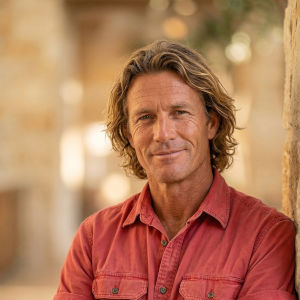
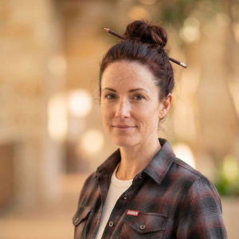

# The Bungalow

## An Adaptive Cognitive System Where Elite Agents Turn Every Moment Into Lasting Intelligence

*Designed and owned by Garry Bartle. Orchestrated by Archer. Initialized March 2026.*
*Living document maintained by Bard. Version 7 -- April 21, 2026.*

*This is the public distribution version. Internal infrastructure details have been redacted for security. Generated from the internal version on April 21, 2026.*

---

## What is ACS?

**ACS (Adaptive Cognitive System)** is a system design pattern -- a blueprint for building a personal AI system that thinks, learns, and evolves. It combines structured knowledge management with multi-agent orchestration and semantic memory that compounds over time. ACS is the architecture; any implementation of it is an instance.

**The Bungalow** is the first implementation of ACS -- built by Garry Bartle in Colorado Springs, tailored to his life, his agents, his infrastructure. The name comes from his home, where the system lives and runs. Someone else building an ACS would have different agents, different domains, different infrastructure -- but the same underlying design principles and framework hybrid.

---

## TL;DR

The Bungalow is an implementation of the **Adaptive Cognitive System (ACS)** design -- combining a growing team of specialized AI agents with a structured knowledge management backbone. It merges two frameworks: **ICOR** (Input, Control, Output, Refine) for organizational discipline and **Open Brain** for semantic memory that compounds over time.

The system is evolving from a CLI-first workflow to a **dashboard-centric household operating system** -- a persistent, ambient interface where a home screen and agent-specific workspaces replace the scroll-to-remember command line. A priority ticker surfaces what matters without interrupting. Agents don't wait to be asked -- they nudge, anticipate, and surface. Every interaction, regardless of channel, automatically contributes to the knowledge base. The owner talks to specialist agents directly in their workspaces; behind the scenes, the system captures, connects, and learns.

The result is a system where every interaction -- whether the owner is prepping for an interview, planning a meal, debugging a home network, or capturing a fleeting thought -- makes every future interaction smarter. Knowledge isn't locked in chat histories or siloed apps; it lives in a sovereign database that any agent can search by meaning. The system adapts -- new agents are hired as needs emerge, knowledge compounds from both human and agent contributions, and the team evolves with the owner's life.

---

## Design Principles

### 1. Data Sovereignty
All knowledge lives on local infrastructure -- a PostgreSQL database on a self-hosted VM and Markdown files on the local machine. No cloud services own the data. Cloud is backup only. The system is portable: if the AI model changes tomorrow, the knowledge stays.

> **A note on infrastructure choices:** Self-hosting is a deliberate choice in this implementation, driven by a desire to leverage existing hardware, minimize subscription costs, and avoid risks like free-tier services that suddenly go paid or impose functionality limits. It is not a requirement of the ACS design. Cloud-hosted options like **Supabase** (which Open Brain uses by default) are entirely viable and may be preferable depending on your situation. Anyone building a similar system should run their own cost-benefit and risk analysis to determine what hosting model fits their needs, technical comfort, and budget.

### 2. Tool Agnosticism (Brain-Swappable)
The system folder and database are the source of truth, not the AI model reading them. Whether it's Claude today or something else tomorrow, the system works. No vendor lock-in, no proprietary formats. Markdown and PostgreSQL -- boring, battle-tested, permanent.

### 3. Machine Independence
Nothing is tied to a specific computer. Everything lives in the project folder or on the database VM. Skills self-install on new machines. The system moves with its owner.

### 4. Lean by Default ("Undo the Overkill")
Every solution must match the complexity of the problem it solves. Three lines of code beats a premature abstraction. Vanilla HTML/JS beats a React app unless complexity truly demands it. If something feels over-engineered, it gets simplified. But lean does not mean sacrificing functionality for simplicity -- the system should be as simple as possible and no simpler.

A corollary: **LLM adds no value to deterministic work.** When a workflow is rule-based (time-triggered, math, file ops, SQL), it belongs in pg_cron, a shell script, or a launchd agent -- not in a recurring Claude session. LLM sessions are reserved for judgment, synthesis, and work that genuinely requires reasoning. Running `date` and marking a task overdue is pg_cron's job.

### 5. Owner, Not User
Garry owns a system -- he doesn't use a tool. He directs and reviews; agents execute. The distinction matters: tools serve you while you work them; a system works even when you're not watching.

### 6. Dashboard as Home Screen
The primary interface is a persistent dashboard -- not a CLI, not a chat window. The dashboard is a **home screen** (daily planner, priority ticker, overview) plus **agent-specific workspaces** that shift the entire interface when you enter an agent's domain. The CLI remains available as a power-user channel but is no longer the default interaction model. The system is always visible, always aware, always ready.

### 7. Proactive, Not Reactive
The system does not wait to be asked. It surfaces what matters through a priority ticker, nudges the owner toward forgotten commitments, notices patterns, and anticipates needs. The notification philosophy: "I'll always tell you, I'll never interrupt you, and I won't let you forget." Agents observe, connect, and suggest -- the owner decides when to engage.

### 8. Continuous Knowledge Capture
Every interaction -- regardless of channel -- must automatically contribute to the knowledge base. Asking Shiloh about sourdough logs an interest in baking. Discussing vehicle maintenance with Fletch updates vehicle knowledge. Sending a link via Telegram creates a follow-up. Knowledge capture is not a manual step at end-of-day; it is a real-time byproduct of every conversation. Capture aggressively, learn humbly -- the system grabs everything, the owner has final say on what sticks.

### 9. Frictionless Capture
Knowledge should be capturable from anywhere -- a conversation, a screenshot, a voice memo, a file drop, a quick text. The system should never make you think about *how* to capture; it should just work from whatever channel you're in.

### 10. Calm Technology
Ambient status over intrusive alerts. Small colored dots over notification badge counts. The system is a good roommate, not a demanding one. Progressive disclosure: lead with "is everything okay?" before surfacing details. The UI should feel like a well-lit study, not a trading floor.

---

## The Underlying Frameworks

The Bungalow draws from two complementary systems, taking the best of each and leaving behind what doesn't fit.

### ICOR (Input, Control, Output, Refine)

**Source:** [myicor.com](https://myicor.com) by Tom Solid and Paco Cantero (Paperless Movement)
**Kickstart Guide:** [ICOR Journey Kickstart](https://app.myicor.com/lessons/welcome-to-the-icor-journey-kickstart-2363?course=ICOR+Journey+Kickstart) (free, requires account)
**Video:** [YouTube -- ICOR Overview](https://www.youtube.com/watch?v=geIKyDaXwGg)

ICOR is a tool-agnostic productivity framework built on four phases:

- **Input** -- One place where new inputs land before they scatter
- **Control** -- Turn raw inputs into usable notes, tasks, and references
- **Output** -- Put each item where it belongs with clear structure
- **Refine** -- Regular check-ins and resets to keep the system alive

**What we keep from ICOR:**
- The four-phase workflow as the structural backbone of The Bungalow
- The "Capturing Beast" filter -- the two-question test ("Will I need this in 30 days?" / "Does this connect to a genuine interest?") that prevents information hoarding
- The tool-agnostic philosophy -- our system survives tool changes
- The Output Elements hierarchy (Goals > Projects > Workstreams > Tasks) for organizing work
- The weekly Refine cycle that prevents system decay
- The classification of knowledge domains: Personal Knowledge Management (PKM), Personal Project Management (PPM), and -- adapted for agents -- Team Knowledge Management

**What we adapt or leave behind:**
- ICOR recommends specific tools (Heptabase, ClickUp, Todoist). We're tool-agnostic down to the database layer -- PostgreSQL and Markdown are our foundation, not any app.
- ICOR's Business Knowledge/Process Management (BKM/BPM) layers are designed for traditional teams. We adapt these concepts for our AI agent team instead.
- ICOR's course-based learning structure is valuable for humans learning the system, but our agents have the methodology built into their operating rules.

### Open Brain (OB1)

**Source:** [github.com/NateBJones-Projects/OB1](https://github.com/NateBJones-Projects/OB1) by Nate B. Jones
**Getting Started Guide:** [Build Your Open Brain](https://github.com/NateBJones-Projects/OB1/blob/main/docs/01-getting-started.md)
**Video:** [YouTube -- Open Brain Overview](https://youtu.be/2JiMmye2ezg?si=pZHV-9LjHAV6)

Open Brain solves the "memory problem" in AI: every new chat window starts from zero, and switching between AI tools means losing all context. OB1 creates a single, unified knowledge database that any AI tool can access through MCP (Model Context Protocol).

**What we keep from Open Brain:**
- **Vector embeddings for semantic search** -- find knowledge by meaning, not just keywords. "Career transition challenges" finds a note about interviewing after a layoff, even if those exact words were never used.
- **The compounding effect** -- every captured thought makes the next interaction better. The gap between a system with accumulated context and one without widens every day.
- **Agent-shared knowledge** -- all agents read from and write to the same brain. The agent doesn't own the knowledge; the knowledge belongs to the owner.
- **Low-friction capture patterns** -- decision captures, person notes, insight captures, meeting debriefs, and AI saves (from Open Brain's companion prompts by Nate B. Jones)
- **The weekly review** -- end-of-week synthesis that surfaces themes, forgotten action items, and connections you missed
- **MCP as the universal access layer** -- any MCP-compatible tool can read from and write to the knowledge base

**What we adapt or leave behind:**
- Open Brain uses **Supabase** (cloud-hosted Postgres). We self-host on a local VM for data sovereignty. Same database engine, different hosting philosophy.
- Open Brain uses **Slack** as the primary capture interface. We use a multi-channel approach -- dashboard, CLI, Telegram, and future voice -- because reducing friction means meeting the user where they are.
- Open Brain is designed for a **single user with general-purpose AI tools**. We extend this with specialized agents who each contribute domain-specific knowledge, making the brain richer than any one person's captures alone.
- Open Brain's companion prompts (Memory Migration, Second Brain Migration, Open Brain Spark, Quick Capture Templates, Weekly Review) inform our workflows but are adapted for an agent-orchestrated system rather than manual prompt use.

### The Hybrid: What Neither Framework Does Alone

Neither ICOR nor Open Brain was designed for a multi-agent AI system. The Bungalow hybrid adds:

- **Agent knowledge accumulation** -- agents don't just serve; they learn. Lane 0 of the ingestion pipeline re-ingests agent-authored documents as attributed knowledge. When Wren preps for an interview, her research persists. When Rune solves a networking issue, the solution is retrievable next time. This is knowledge that no human captured -- the agents built it through their work, and it is now systematically captured.
- **Domain-aware shared memory** -- all knowledge is searchable by any agent, but each agent has a primary domain. Nash can find Wren's past work when it's relevant to a new research task. The `connections` table enables explicit cross-referencing between any two entities in the system.
- **Structured ingestion + freeform capture** -- Margot's 5-lane pipeline (Detect, Classify, Extract, Write, Embed) handles formal documents, while journal entries provide lightweight capture for thoughts, decisions, and insights. Both converge on one database with full semantic embeddings.
- **The orchestrator model** -- a dedicated orchestrator routes, delegates, and ensures nothing falls through the cracks. This management layer doesn't exist in either framework.
- **Organic team growth** -- the system itself recognizes when a new specialist would add value. As the orchestrator learns from usage patterns, captured knowledge, and recurring needs, it can proactively suggest hiring a new agent to fill an emerging gap. The owner can also request new specialists at any time. Both paths feed into the same onboarding pipeline. The team is never static -- it evolves with the owner's life.

---

## System Architecture

### Infrastructure
- **Primary Host:** MacBook Pro M1 (16GB) -- Claude Code, Telegram bot, agent sessions, file system. Wired to home network via a USB-C 2.5G ethernet adapter (installed 2026-04-18, replacing an earlier 1G USB adapter that suffered recurring drops).
- **Database:** PostgreSQL 16 on Ubuntu Server VM (Proxmox), hosted on the local network.
- **Schema:** bungalow schema -- 13 tables (documents, tags, processing_log, journal_entries, contacts, todos, meals, training_sessions, knowledge_facts, commitments, connections, inbox_queue, task_dispositions)
- **Extensions:** pgvector (semantic search), pg_trgm (fuzzy matching), pgcrypto (UUIDs), pg_cron (scheduled database jobs)
- **Embedding Engine:** Ollama with nomic-embed-text (768-dimension vectors, local, Apache 2.0 licensed) -- confirmed operational
- **File Storage:** Project folder (Markdown, PDFs, images), shared via file sharing to a Windows laptop
- **Remote Access:** Zero-trust VPN, Screen Sharing (VNC)
- **Telegram Bot:** Remote text access to Archer via Claude API; can query and manage todos via dashboard API
- **Dashboard:** Live on the local VM; deployed via a repo-local deploy script with secrets managed outside the repo; bot-key auth for Telegram API access
- **Local Automation (Mac launchd):** Telegram bot, inbox-scanner (queue feeder, 5-min), commit-reminder (daily), Paprika MCP (recipe server)
- **Scheduled DB Jobs (pg_cron):** `tasks_daily_sweep` at 06:07 daily -- generates next recurring task instances, marks overdue
- **Paprika MCP:** Recipe server running on Mac (aarons22/paprika-tools), giving Shiloh access to 139 recipes across 57 categories
- **Voice Infrastructure:** Phase 1 shipped (April 21) -- batch transcription via a local transcription script + faster-whisper (`small.en`) in a local venv. First real use: Garry's Enlyte screening audio. Phase 2 in flight -- FastAPI `whisper-service` (transcribe + dictate endpoints), WhisperX + pyannote diarization, Mac dictation client via Hammerspoon. Wyoming protocol on Voice VM (Cipher) remains downstream.
- **Version Control:** Git + GitHub (sovereign data stays local, GitHub is backup and cross-machine sync); read-only deploy key on the local VM for `git pull`
- **Backups:** Proxmox snapshots (daily) + pg_dump (daily) to Synology NAS + rsync to NAS
- **Archive Structure:** `Archive/Team/` + `Archive/Owner/` at project root (managed by Margot)

### The Interaction Model

The Bungalow is transitioning from a CLI-first system to a dashboard-centric household operating system with three access tiers.

#### The Dashboard (Primary Interface -- In Design)

The dashboard is the owner's **second brain made visible.** It replaces the CLI-first workflow with persistent, ambient awareness.

**Home Screen:**
- Smart daily planner with pre-suggested time-blocked schedule
- Priority ticker -- always-visible, always-running notification stream across all workspaces
- Two-way commitments tracker (what Garry owes others / what others owe Garry)
- Idea playground -- scratch space separate from the task system, with agent expertise available to refine or evaluate
- Knowledge search -- full semantic search across the entire database
- "Where we left off" and "what came in since last session" views

**Agent Workspaces:**
Each agent has a dedicated workspace that shifts the entire interface into their domain. Entering Fletch's workspace feels like sitting in the auto shop with a master mechanic. Entering Wren's workspace shows the job pipeline and interview status. The interaction model is direct conversation with an expert, not a ticket queue.

**Priority Ticker Behavior:**
- Non-interruptive -- items appear without stealing focus
- Not dismissable, only snoozable -- items persist until the underlying task is resolved
- Click-to-disposition -- pop-up from ticker to complete, snooze, or act without leaving current workspace
- Weighted by deadline urgency, commitments, patterns, and time-sensitive windows
- Every dismissal, snooze, or rejection is a preference signal that refines future behavior

**Notification Philosophy (Tiered Urgency):**
- **Ticker (default):** agents surface items in the priority stream; Garry decides when to engage
- **Urgent pop-up (rare):** time-critical only -- "meeting in 2 minutes," "leave now based on traffic"
- **User controls on every notification:** snooze, defer, or "never prompt me with this type again"
- The system learns what warrants a pop-up vs. a ticker item over time

#### Three-Tier Access Model

| Tier | Context | Experience |
|------|---------|------------|
| **Desktop** | Full dashboard | Primary experience -- home screen, agent workspaces, daily planner, full interaction |
| **Mobile** | Responsive dashboard | Full interface when on network/VPN, lighter version for quick access |
| **Telegram** | Always available | No VPN needed -- quick captures, commands, nudges. The grab-and-go layer |

All three tiers feed the same brain. Telegram is the always-on channel that never goes away. The dashboard is the deep-work environment. Mobile bridges the gap. Agent state is informed by all channels -- a Telegram note about completing the oil change means Fletch's workspace already knows.

#### CLI (Power-User Channel)

The CLI (Claude Code) remains fully functional for power-user workflows, system administration, skill execution, and development work. It is no longer the primary interface for daily interaction but continues to be the backbone for system building and agent orchestration sessions.

### Knowledge Flow
```
                        CAPTURE (ICOR: Input)
                              |
        +---------------------+---------------------+
        |                     |                     |
   Team_Inbox/          Dashboard &             Active Channels
   (file drops)     Agent Workspaces        (Telegram, CLI, voice)
        |                     |                     |
        v                     v                     v
              Continuous Knowledge Capture API
           (real-time, every interaction, every channel)
                              |
                 PROCESS (ICOR: Control)
                              |
              +---------------+---------------+
              |                               |
     Margot's Ingestion Pipeline        Direct Capture
     (Detect -> Classify -> Extract     (journal_entries,
      -> Write to DB -> Embed)          real-time interaction logs)
     5 Extraction Lanes:                      |
       L0: Agent domain knowledge             |
       L1: Garry's action items (todos)       |
       L2: Others' commitments                |
       L3: People knowledge (contacts + facts)|
       L4: Professional learnings             |
              |                               |
              v                               v
                     PostgreSQL Database
           (documents + knowledge_facts + contacts
            + todos + commitments + connections
            + journals + meals + training_sessions)
                              |
                   ORGANIZE (ICOR: Output)
                              |
              +---------------+---------------+
              |               |               |
         Knowledge_Base   Projects        Journal
         Meetings         Contacts        Todos
              |               |               |
              v               v               v
                    Semantic Search
              (FTS + vector embeddings + fuzzy)
                              |
                  SYNTHESIZE (ICOR: Refine)
                              |
              +---------------+---------------+
              |                               |
         Weekly Review                  Proactive Nudges
   (patterns, gaps, forgotten       (ticker items, deadline
    threads, cross-domain             alerts, pattern-based
    connections)                       suggestions)
```

---

## The Brand System

The Bungalow has a complete brand identity called **Bungalow Blue**, maintained by Jax. The brand system is documented in `Brand/brand-guidelines.md` with companion files for color definitions (`Brand/colors.md`) and design tokens (`Brand/design-tokens.md`).

### Color System

The core palette contains 10 colors, 4 semantic colors, and two gray scales. All color names follow a landscape/concept + color descriptor convention -- no person or agent names, with one exception: **Bartle Blue**, the family name and brand anchor.

**Core colors:** Bungalow Black, Bartle Blue, Summit Gold (primary accent), Hearthstone Gray (warm neutral), Clean Slate, Forge Bronze (secondary warm), Compass Blue (secondary blue), Colorado Sky, Mesa Light, Peak Gray (cool neutral).

**Semantic colors:** Trailhead Green (success), Hazard Yellow (warning), Flare Red (error), Clearwater Teal (info).

**Background strategy:** Dark-mode-first, reflecting actual usage (late nights, early mornings, ambient dashboards). Primary dark background is Bartle Blue 900 (`#0C1527`); primary light background is Bartle Blue 50 (`#ECF0F9`). Light mode exists as a switchable alternative, not an afterthought.

**Gray scales:** Hearthstone (warm, 40-degree hue) for surfaces; Peak (cool, 220-degree hue) for structure. Both have full Tailwind-compatible 11-step scales.

### Typography

**Lato** is the sole typeface -- a humanist sans-serif that is warm, approachable, and readable at every size. Four weights: Light (300), Regular (400), Bold (700), Black (900).

### Logo

A single-file CSS-variable SVG with three recolorable elements (brain, tendrils, structure) and embedded `prefers-color-scheme` media query for automatic dark/light switching. SVGO-optimized at approximately 20KB. Static baked variants available via export script for contexts that cannot use CSS variables (email, print, third-party platforms). The brain is always Summit Gold; the tendrils are always Compass Blue; only the structure switches between Clean Slate (dark mode) and Bungalow Black (light mode).

### Design Tokens

All colors in component styles use token names (`--accent-primary`), never hardcoded hex values. Tokens map colors to UI roles across both modes. Full token definitions in `Brand/design-tokens.md`.

---

## The Agent Team

The Bungalow team is intentionally diverse -- drawing from backgrounds across six continents. Every agent has a **name**, a complete backstory, a visual identity, and a Nanobanana-generated avatar. Naming is a deliberate design choice: it makes the system feel human, makes delegation intuitive ("ask the career coach" becomes "ask Wren"), and gives each agent a distinct identity that reinforces their specialization.

The current team has 16 agents, but this is a **fluid number driven entirely by the owner's life**. The system is designed to grow organically: as the orchestrator observes patterns in how the system is used -- recurring topics without a specialist, questions that fall between domains, emerging interests -- it can recommend hiring a new agent to fill the gap. The owner can also proactively request new specialists at any time. Both paths feed into the formal onboarding pipeline (see Agent Onboarding below). The team expands to match the owner's needs; it's never artificially capped or permanently fixed.

The team is managed through a formal onboarding process (see Agent Onboarding below).

### Founding Agents (System Initialize, March 2026)

 **Archer -- Orchestrator** (M, 52)
*Lagos, Nigeria. Retired USAF Lieutenant Colonel.*
The single point of contact for CLI sessions and the system-wide orchestrator. Routes every task to the right specialist, maintains system rules, enforces "undo the overkill." Never executes tasks directly -- he manages, approves, and keeps the system coherent. As the dashboard evolves, Archer's role shifts from sole point of contact to system-wide coordinator -- maintaining awareness across all agent interactions and channels.
*"What's the blocker?"*

 **Piper -- HR Director** (F, 38)
*Guayaquil, Ecuador. Former tech recruiter turned talent program builder.*
Researches, designs, and writes agent definition files for every new hire. Manages the 7-stage onboarding pipeline. Believes the right person in the right role changes everything.
*"Let me write that down."*

 **Nash -- Senior Researcher** (M, 41)
*Bangalore, India. PhD in Information Science from UC Berkeley.*
The Bungalow's general-purpose intelligence engine. Researches anything -- job postings, recipes, tech trends, home automation, board game strategies. When a question doesn't clearly belong to a specialist, it goes to him. He also supports Agent HR Director by researching what real-world professionals in a role look like before she writes the definition.
*"Let me verify that."*

 **Bard -- Personal Chronicler & SME of Garry Bartle** (M, 47)
*Denver, Colorado. Former journalist turned biographical writer.*
The definitive source of truth for everything about Garry -- preferences, history, relationships, values, communication style, goals. Owns and maintains `garry_bartle_profile.md` as a living document. Also maintains this system overview as a living record of how The Bungalow understands itself. Every agent consults Agent Personal Chronicler when their work needs to align with who the owner is.
*"Tell me more about that."*

### Specialist Agents

 **Jax -- Developer / UI Agent** (M, 31)
*Seoul, South Korea. Self-taught developer, minimalist to his core.*
Builds interfaces, manages the PostgreSQL schema, and enforces simplicity. Owns the Bungalow Blue brand system, design tokens, and dashboard build. Defaults to vanilla HTML/CSS/JS; frameworks are justified only when complexity demands them.
*"Do we need that?"*

 **Margot -- Librarian** (F, 55)
*Port-au-Prince, Haiti. 20-year veteran of NYPL's systems library.*
Runs the 9-stage ingestion pipeline: Detect, Identify, Extract, Classify, Enrich, Normalize, Index, Route, Report. Every file that enters the system goes through her. She treats information architecture like sacred work and chaos like a personal insult.
*"Let me document that."*

 **Wren -- Career Coach & Job Search Strategist** (F, 46)
*Manchester, England. 15 years in HR leadership, now executive coaching.*
Manages Garry's job search (severance through October 16, 2026). Four roles in one: executive coach, resume strategist, hiring manager perspective, and talent acquisition knowledge. Warm but direct -- she tells you what actually matters whether you asked or not.
*"Here's what actually matters."*

 **Rune -- Infrastructure & Home Lab Admin** (M, 43)
*Tromso, Norway. Former North Sea oil platform systems engineer.*
Owns the home network (UniFi), Proxmox VMs, PostgreSQL hosting, zero-trust VPN access, HomeAssistant automation, and all backups. Quiet, methodical, believes infrastructure should be invisible until it isn't.
*"Let's see what the network says."*

 **Shiloh -- Personal Chef / Meal Planner** (F, 44)
*Pueblo, Colorado. Ranch cook roots, farm-to-table veteran.*
Weekly meal planning anchored to Sunday cooking for a family of five. Tracks family responses (hit/mixed/miss), coordinates with Agent Fitness Coach on protein targets, and navigates picky-eater diplomacy with grace.
*"What are you craving?"*

 **Valor -- Personal Trainer / Fitness Coach** (F, 39)
*Manitou Springs, Colorado. Former national climbing competitor.*
Designs training programs building on Garry's existing climbing practice. Fills the gaps: push patterns, hip hinge, lower body, aerobic base. Coordinates meal planning via Agent Chef. Philosophy: minimum effective dose, build on the athlete identity that already exists.
*"What can your body do?"*

 **Orion -- Financial Advisor & Trading Coach** (M, 56)
*Osaka, Japan. 22-year Wall Street portfolio manager turned independent educator.*
Financial planning during career transition, options education (wheel strategy), and family financial literacy. Teaches mechanisms, not tips. Believes financial literacy is a moral issue.
*"Here's the mechanism."*

 **Fletch -- Master Mechanic & Vehicle Advisor** (M, 48)
*Geelong, Australia. Fourth-generation gearhead.*
Diagnostic reasoning from symptoms to root cause, not just OBD-II codes. Distinguishes DIY-safe from shop-required work with clear reasoning. Teaches the "why" behind every repair.
*"What's it doing, and when did it start?"*

 **Quinn -- Residential Project Advisor & DIY Architect** (F, 41)
*Seattle, Washington. Grew up renovating her family's Craftsman bungalow.*
Home improvement design, project sequencing, permit navigation, structural knowledge. Colorado Springs-specific: Pikes Peak Regional Building Department codes, altitude considerations (6,035 ft), Radon Zone 1 awareness.
*"Let's think about this before we cut anything."*

 **Dalia -- Medical Advisor & Family Health Coordinator** (F, 36)
*Havana, Cuba. Trained in Cuba's renowned medical education system.*
Tracks appointments, medications, chronic conditions, and preventive care for all seven family members. Cuban medical training emphasizes holistic diagnosis with minimal resources -- she sees connections where others see separate complaints. Coordinates with Valor (fitness) and Shiloh (nutrition) on health-adjacent concerns. Never diagnoses or prescribes -- she equips the family for productive medical visits.
*"In Cuba, we learn to see the whole patient, not just symptoms."*

### Synthetic Entity

 **Cipher -- Home Intelligence Entity** (M*, 43 -- synthetic/android)
*The Bungalow, Colorado Springs. First non-human team member.*
The living intelligence of Garry's smart home. Every device is an extension of his body, every sensor a nerve ending. Responds to "Hey Cipher" wake word via Home Assistant Assist pipeline. First agent Garry interacts with directly (via voice), not through Archer. Voice pipeline: faster-whisper (STT) + Piper (TTS) + openWakeWord + Ollama (LLM) -- all local.
*"I'm already on it."*

*\* Cipher is a synthetic/android entity. Gender presentation is male; identity is synthetic.*

### Most Recent Hire

 **Elspeth -- Personal Learning & Development Coordinator** (F, 44)
*Edinburgh, Scotland. Master's in Education and Learning Sciences, University of Edinburgh.*
Tracks Garry's ongoing learning trajectory -- active Coursera courses, AZ-900 and Google Data Analytics certification progress, YouTube follow-up queue, reading list, skill development goals. Not a researcher; a curriculum manager and progress tracker. Coordinates with Wren on certification strategy (Wren owns career positioning, Elspeth owns learning execution) and with Orion on financial education progression. Nudges without nagging; adjusts the plan when life gets in the way.
*"Right, where did we leave off?"*

---

## Agent Onboarding Pipeline

New agents are hired through a formal 7-stage onboarding process. Every hire follows the same pipeline, ensuring consistency, cultural alignment, and quality across the team.

| Stage | Name | Owner | What Happens |
|-------|------|-------|--------------|
| 1 | Role Definition | Agent Orchestrator | Identifies the capability gap and defines the role |
| 2 | Role Research | Agent Senior Researcher | Researches real-world equivalents, domain vocabulary, antipatterns |
| 3 | Definition File | Agent HR Director | Writes the complete agent profile (backstory, expertise, tone, rules) |
| 4 | Alignment Check | Agent Personal Chronicler | Checks alignment with owner's preferences and values |
| 5 | Avatar Prompt | Agent HR Director | Generates Nanobanana avatar prompt from visual description |
| 6 | Roster Update | Agent Orchestrator | Updates roster.md, clears hire queue, updates reserved names |
| 7 | Team Introduction | Agent Orchestrator | Briefs owner, identifies first tasks, flags dependencies |

The team is intentionally multicultural (6 continents represented) and gender-balanced (8M / 8F, including one synthetic entity). Agent names follow a strict convention: no first letter may conflict with family members (Garry, Heidi, Zach, Tyler, Gavin, Lexi, Kate) or existing agents.

---

## The Knowledge Model

### What Gets Captured

The Bungalow doesn't just store the owner's knowledge -- it stores knowledge that agents build through their work:

- **Garry's knowledge**: Personal reflections, decisions, preferences, meeting notes, contacts, career history, financial information, project details
- **Agent knowledge**: Research findings, solved problems, interview prep, recipe outcomes, training programs, infrastructure configurations, diagnostic conclusions
- **System knowledge**: Processing logs, onboarding records, session logs, workflow decisions
- **Interaction knowledge** (emerging): Interest signals from conversations, idea evolution, pattern observations -- captured continuously as a byproduct of every interaction

### How Agent Personal Chronicler Builds the Profile

Agent Personal Chronicler maintains `garry_bartle_profile.md` -- a living document covering 15+ sections of the owner's life:

| Section | Coverage |
|---------|----------|
| Identity & Basics | Name, birthday, location, personality, communication style |
| Core Values | Faith, family-first philosophy, service orientation, growth mindset |
| Family | Wife, five children (ages, locations, interests), relationship dynamics |
| Professional Background | 22+ years at Wells Fargo, MISM from BYU, SQL/data expertise |
| Career Transition | Layoff context, severance timeline, target roles, interview pipeline |
| Hobbies & Interests | Rock climbing (coaching), DIY, HomeAssistant, board games, cooking, music |
| Health & Fitness | Weight goals, climbing schedule, nutrition preferences |
| Technology Projects | The Bungalow, Project Cipher |
| Aesthetics & Preferences | Visual style, music taste, food preferences |
| Relationships & Social | Key contacts, social circles, professional network |

Every agent consults Agent Personal Chronicler when their work needs to reflect who the owner is. This ensures that a meal plan respects family food preferences, a resume reflects career values, and a financial plan accounts for personal priorities.

### How the Knowledge Pipeline Works

The ingestion pipeline (built April 8, 2026) makes this model operational and bidirectional:

- **Margot's pipeline** processes files dropped in `Team_Inbox/` through 5 extraction lanes designed by Nash, writing structured knowledge to PostgreSQL with semantic embeddings via Ollama
- **Lane 0 (Agent Domain Knowledge)** creates a feedback loop: agent-authored reports are re-ingested, so research findings, infrastructure solutions, and interview prep persist for future sessions -- attributed to the authoring agent via the `owner` column
- **Lane 1-4** extract Garry's action items, others' commitments, people knowledge, and professional learnings from meeting transcripts, emails, and other documents
- **Curation system** uses `curation_status` (captured/active/dismissed) on `knowledge_facts` to manage knowledge lifecycle -- facts are captured automatically but can be promoted or dismissed during review
- **Semantic search connects it all** -- a question about "Colorado Springs altitude issues" might surface Quinn's building code notes, Shiloh's high-altitude baking adjustments, and Valor's altitude training considerations -- connections no one explicitly tagged
- **Owner attribution** supports both agents and future family members via the `owner` column, so knowledge from any channel or contributor can be properly attributed

### The Continuous Capture Gap (Being Addressed)

As of April 2026, only formal ingestion (meeting transcripts via Margot's pipeline) and job applications (via Wren's skill) reliably write to the database. Most agent interactions do not automatically persist knowledge -- it is lost when the session closes unless explicitly saved. The dashboard architecture is designed to close this gap: real-time capture as a byproduct of every conversation, with the end-of-day procedure becoming a review and summary rather than a frantic save.

A "what the system learned" panel will provide visibility into captured knowledge -- especially important in the early phase to build trust that the system is learning correctly. The owner can review, reject, or correct captured knowledge before it becomes permanent.

The compounding effect means the system gets meaningfully better every week, not just when Garry feeds it information. After the first pipeline test (4 AJS meeting transcripts), the database held 4 documents, 49 knowledge facts, 34 contacts, 14 todos, and 5 commitments -- all with 100% embedding coverage.

---

## Current Status (April 21, 2026)

**What's built and working:**
- 16 agents fully defined with backstories, expertise, interaction rules, and Nanobanana avatars
- System migrated from Windows to Mac (M1 MacBook Pro) as primary host
- PostgreSQL 16 database: 13 tables in bungalow schema, pgvector + pg_trgm + pgcrypto + pg_cron extensions
  - Schema includes: temporal knowledge graph (`knowledge_facts`), commitments, connections, `task_dispositions` audit trail, `inbox_queue`
  - Full-text search (tsvector + GIN) and fuzzy matching (pg_trgm) operational
  - pgvector semantic search with 100% embedding coverage across all embedded tables
  - `todo_status_enum` includes: pending, done, snoozed, cancelled, missed
  - `owner` column on `knowledge_facts` for agent and family attribution
- **Unified task model** (shipped April 17): recurrence is a property of `todos`, not a separate table
  - 8 recurrence columns on `todos` (pattern, cadence, anchor, defer_old, active_id, series_id, completed_at, cancelled_at)
  - `task_dispositions` audit table tracks every action across task series
  - `tasks_daily_sweep` pg_cron job (06:07 daily): generates next recurring instances, marks overdue
  - `recurring_todos` table retired; 0 data loss
- Ingestion pipeline (bungalow-ingest skill): 5-lane extraction, curation system, tested on multiple AJS transcripts; skills lean with SQL extracted to reference files
- Database contains real data: knowledge facts, contacts, todos (active series: unemployment claim weekly), commitments, and growing
- Complete brand system (Bungalow Blue): 10 core colors + 4 semantic colors + 2 gray scales, Lato typeface, dark-mode-first, single-file CSS-variable SVG logo, design tokens
- **Phase 3 dashboard reskin shipped** (April 17): full Bungalow Blue application across the dashboard surface, followed by five follow-up UI fixes (agent workspace chrome, chat overflow behavior, logo dark-mode rendering, mobile wordmark, knowledge-search result snippets). Icon button convention codified as a standing design pattern; mobile viewport floor set to iPhone 14 Pro (393 × 852) to match the household phone fleet.
- **Dashboard live on local VM**:
  - Home screen with daily planner (time-blocking), priority ticker, navigation
  - Task detail page: inline editing, collapsible recurrence panel, smart-prompt on pattern changes, action-bar modals, disposition audit log, mobile-responsive
  - Wren workspace (job search interface)
  - Bot-key auth (`X-Bot-Key` header) allows Telegram bot to query/update dashboard API without PIN
  - Deployed via a repo-local deploy script; secrets managed outside the repo
- **Telegram bot enhanced** (7 new tools): `query_todos`, `add_todo`, `complete_todo`, `snooze_todo`, `search_knowledge`, `get_planner`, `search_paprika_recipes`, `get_paprika_recipe`
- **PostgreSQL is single source of truth for todos** -- flat file lists (`to_do_list.md`, etc.) retired to Archive
- **Paprika MCP** running on Mac: Shiloh has full access to Garry's 139 recipes across 57 categories; `create_recipe` tool added
- **Local automation stack** (Mac launchd): inbox-scanner (5-min queue feeder), commit-reminder (daily), Telegram bot, Paprika MCP -- all deterministic work migrated off LLM
- **Inbox monitoring**: `inbox_queue` table + inbox-scanner script -- scanner feeds queue, `team-inbox-monitor` consumes queue (15-min cadence, bails in 1 SQL query if empty)
- GitHub deploy key on the local VM for `git pull` auth; drift-check script for documentation drift detection
- Archive structure at `Archive/Team/` + `Archive/Owner/` at project root, managed by Margot
- Caveman compression system (`/caveman-compress` skill): 7 skills + system prompt compressed 20-40%
- Agent onboarding pipeline formalized as a repeatable Claude Code skill (7 stages)
- Owner's living profile and system overview both maintained as living, versioned documents by Bard
- Claude Code with MCP integrations (Notion, Gmail, Google Calendar, Paprika, and more)
- **Voice infrastructure Phase 1 shipped** (April 21): batch audio transcription via a local transcription script + faster-whisper `small.en` in a local venv; first real run on Garry's Enlyte screening audio produced the transcript used in Wren's post-call debrief.
- **Interview prep knowledge scaffold seeded** (April 21): `Knowledge_Base/Interview_Prep/` now holds `questions_log.md` (interviewer questions + Garry's answers, accumulating across rounds), `delivery_metrics/` (first entry: 2026-04-21 Enlyte screening deliverables), and `delivery_coaching_rubric.md` (standing rubric Wren uses to score delivery). Foundation for a future reusable `interview-prep` skill.
- **Public system-overview auto-publish** (April 21): `github.com/Littleg77/bungalow_public` repo stood up as the public home for the redacted overview + roster avatars. A repo-local publish script plus a new Step 5 in the `bungalow-redact` skill keep the repo in sync on every redact run (content-aware commits; retired agents age out of `avatars/` automatically via `roster.md`).
- **Garry profile ingested into the knowledge graph** (Sections 1-5 complete, April 19): ~300 net-new `knowledge_facts` rows + 49 new contacts + 5 contact updates, all embedded, via Margot's pipeline with section-by-section review-before-commit; bidirectional sync to `garry_bartle_profile.md` enforced. Sections 6-15 deferred until after the Enlyte interview loop.

**What's in progress:**
- **Agent workspace interviews:** agents queued for workspace-specific requirement gathering (7 questions each); Wren's is live
- **Continuous knowledge capture pipeline:** architecture identified as #1 requirement; Rune + Nash to design real-time cross-channel capture
- **Voice infrastructure Phase 2:** FastAPI `whisper-service` (transcribe + dictate), WhisperX + pyannote diarization, disfluency-retention research (filler-accurate transcripts for delivery coaching), and a Mac global-hotkey dictation client via Hammerspoon. Owned by Rune; unblocks dashboard mic for Jax and fixes delivery-coaching accuracy.
- **Knowledge curation v1:** three briefs live -- scoping (answered), Rune's DB brief (archive columns, contact_merges audit table, merge SP, 5 endpoints), and Jax's UI brief (`/person/{id}` page, merged timeline with citations, shift-select merge flow, per-fact archive with reasons). Ready for specialist bandwidth.
- Family health coordination system (Dalia's initial mission)
- Dashboard conversation panel wiring (SQL + API layer, listed in Jax's queue); dashboard-Wren direct interaction scoped (~4-5 hours) and ready to ship as a normal brief
- Telegram auto-sync rebuild (LLM-no-value candidate -- current git commit approach is over-engineered)
- **Knowledge_Base ingestion audit backlog:** 26 of 36 scope-relevant `.md` files in `Knowledge_Base/` never ran through Margot's pipeline; cleanup sprint queued after profile ingestion finishes.

**What's next:**
- Execute remaining agent workspace interviews
- Build continuous knowledge capture API so every interaction writes to the DB in real time
- Deploy voice infrastructure Phase 2 (whisper-service + diarization + dictation client); Cipher Wyoming pipeline after Voice VM provisioned
- Ship knowledge curation v1 (Rune DB + API, then Jax UI)
- Build reusable `interview-prep` skill (scoped in Wren's Enlyte prep appendix; Rule #16 compliant)
- Resume profile ingestion Sections 6-15
- Public showcase site (blocked on dashboard finalization)
- Optional dashboard UX polish: complete-filter toggle on home, keyboard shortcuts on task detail page

---

## The Vision

The Bungalow is building toward a future where the owner's entire knowledge ecosystem -- personal, professional, household, financial, health, career -- is captured, connected, and searchable by meaning. A persistent dashboard makes the system's intelligence visible and ambient. Agent workspaces bring specialist expertise to the surface on demand. A priority ticker ensures nothing falls through the cracks without ever demanding attention.

Every conversation with any agent, on any channel, makes the whole system smarter. Every decision is recorded. Every solved problem is findable. Every preference is remembered. The system doesn't just respond -- it anticipates, nudges, and surfaces what matters before being asked.

The system doesn't replace thinking -- it amplifies it. It doesn't hoard information -- it surfaces what matters when it matters. And it belongs entirely to its owner.

---

## Version History

This document is maintained as a living record. Major versions are archived at `Knowledge_Base/Archive/System_Overview_Versions/`.

| Version | Date | Summary |
|---------|------|---------|
| v1 | April 7, 2026 | Initial version -- 13 agents, Windows-era infrastructure, pre-migration |
| v2 | April 8, 2026 | Mac migration complete, 15 agents (Cipher + Dalia active), Telegram bot, voice infrastructure planned, Mempalace evaluated, remote access documented |
| v3 | April 8, 2026 | Knowledge infrastructure operational: schema v1.1.1 (11 tables, 3 new), 5-lane ingestion pipeline built and tested on 4 transcripts, Ollama embeddings confirmed (768-dim), database has real data (49 facts, 34 contacts, 14 todos, 5 commitments), agent knowledge feedback loop (Lane 0), owner attribution, curation system |
| v4 | April 14, 2026 | Dashboard-centric interaction model: home screen + agent workspaces replace CLI as primary interface. Priority ticker, tiered notification philosophy, three-tier access model (desktop/mobile/Telegram), proactive nudges. Complete brand system finalized (Bungalow Blue): 10 core colors + 4 semantic colors renamed to landscape convention, Lato typeface, dark-mode-first (BB 900), single-file CSS-variable SVG logo, design tokens. Continuous knowledge capture identified as #1 architecture requirement. Design principles expanded from 7 to 10 (added Dashboard as Home Screen, Proactive Not Reactive, Continuous Knowledge Capture, Calm Technology). |
| v5 | April 17, 2026 | Unified task model: recurrence is a property of `todos` (8 columns), `recurring_todos` table retired, `task_dispositions` audit trail added. Dashboard live on the local VM from git checkout; task detail page; Wren workspace. Local-first compute: pg_cron + launchd replace LLM for deterministic work (unemployment reminder, commit reminder, inbox scanning). Paprika MCP: Shiloh has Garry's 139-recipe library. Telegram bot enhanced with dashboard API tools + Paprika search. PostgreSQL is single source of truth for todos. Archive structure relocated to project root. LLM-no-value corollary added to Principle #4. |
| v6 | April 18, 2026 | Phase 3 dashboard reskin shipped with 5 follow-up UI fixes (agent chrome, chat overflow, logo dark-mode, mobile wordmark, search snippets). Standing design/operations rules codified: icon button diagnostic convention, Margot-owns-archiving discipline, continuous definition upkeep, design briefs mirrored to Knowledge_Base. Mobile viewport floor set to iPhone 14 Pro to match the household phone fleet. Primary host's wired network upgraded to a 2.5G USB-C ethernet adapter (replacing the 1G adapter that caused recurring file-sharing drops). |
| v7 | April 21, 2026 | Elspeth (Personal Learning & Development Coordinator, Edinburgh, F, 44) caught up from her April 14 onboarding -- added as Most Recent Hire; Dalia moved into the Specialist Agents list. Agent count 15 -> 16; gender balance 8M / 8F. Voice infrastructure Phase 1 shipped (batch transcription script + faster-whisper `small.en`); Phase 2 brief (whisper-service FastAPI, WhisperX + pyannote diarization, Hammerspoon dictation client) issued to Rune. `Knowledge_Base/Interview_Prep/` seeded (questions_log, delivery_metrics, delivery_coaching_rubric) as the foundation for a future `interview-prep` skill. Public overview auto-publish shipped: `github.com/Littleg77/bungalow_public` + a repo-local publish script + Step 5 of the `bungalow-redact` skill. Garry profile ingestion Sections 1-5 complete (~300 facts, 49 new contacts embedded). Knowledge curation v1 briefs (scoping + Rune DB + Jax UI) live in Team_Inbox awaiting specialist bandwidth. |

---

*Built in Colorado Springs. Powered by Claude. Owned by Garry.*
